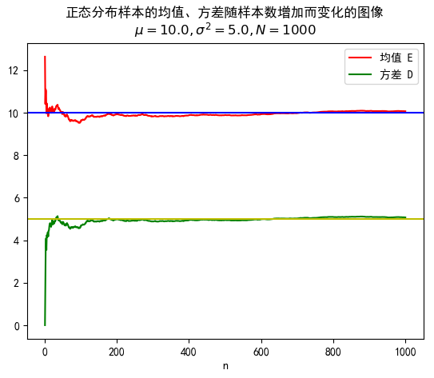

# 随机分布的生成与估计

李一鸣

2018 年 9 月 28 日

## 随机数和随机序列的产生

生成随机序列 $\mathrm{\mathbf{X}} = (X_1, X_2, ..., X_n)$，其中每个 $X_i$ 服从 $[-\frac{a}{2}, \frac{a}{2}]$ 的均匀分布。

生成随机序列 $\mathrm{\mathbf{Y}} = (Y_1, Y_2, ..., Y_n)$，其中每个 $Y_i$ 服从 $[-\frac{a}{2}, \frac{a}{2}]$ 的均匀分布。

**蒙特卡罗投点法：**

在边长为 $a$ 的正方形内随机投点，设该点落入此正方形的内切圆中的概率为 $P_{circle}$，则：

$$
\begin{aligned}
  P_{circle} &= \frac{S_{circle}}{S_{square}} \\
             &= \frac{\pi (\frac{a}{2})^2}{a^2} \\
             &= \frac{\pi}{4}
\end{aligned}
\tag{1}
$$

假定生成的数据中有 $m$ 个在圆内，$n$ 个在圆外。则：

$$
f_{circle} = \frac{m}{n}
\tag{2}
$$

对于任一点 $(X_i, Y_i)$，如果满足：

$$
X_i^2 + Y_i^2 \le (\frac{a}{2})^2 = \frac{a^2}{4}
\tag{3}
$$

则其在圆内，计入 $m$ 中，否则计入 $n$ 中。

以频率估计概率，我们有：

$$
\pi = \frac{4m}{n}
\tag{4}
$$

**实验结果：**

在实验中取 $a = 1$（其实多少都没有关系，精确度只与样本数相关），取 $n = 1\ 000, 10\ 000, 100\ 000, 1\ 000\ 000$ 分别进行实验。

<object width="100%" height="100px" data="./generate_results/monte-carlo-1000.txt"></object>

<object width="100%" height="100px" data="./generate_results/monte-carlo-10000.txt"></object>

<object width="100%" height="100px" data="./generate_results/monte-carlo-100000.txt"></object>

<object width="100%" height="100px" data="./generate_results/monte-carlo-1000000.txt"></object>

## 随机分布的计算机模拟

### 高斯分布的模拟

生成均值为 $\mu = 10$、方差为 $\sigma = 5$ 的正态分布，并画出均值和方差随样本数增加而变化的图。

设总样本数为 $N$，记前 $n$ 个样本数据的均值、方差分别为 $E_n$ 和 $D_n$，则得到均值、方差矩阵：

$$
\mathrm{\mathbf{E}} = (E_1, E_2, ..., E_N) \\
\mathrm{\mathbf{D}} = (D_1, D_2, ..., D_N)
\tag{5}
$$

样本个数矩阵：

$$
\mathrm{\mathbf{N}} = (1, 2, ..., N)
\tag{6}
$$

我们只需要作出 $(\mathrm{\mathbf{N}}, \mathrm{\mathbf{E}})$ 和 $(\mathrm{\mathbf{N}}, \mathrm{\mathbf{D}})$ 的图像即可。

**实验结果：**

在实验中取 $a = 1$，取 $N = 1\ 000, 10\ 000$ 分别进行实验。

### 敌军坦克到达情况的模拟

敌军坦克分队到达我方阵地规律服从泊松分布，平均每分钟到达 $\lambda$ 辆。

泊松分布的期望值是 $\lambda$，也就是说在一分钟之内，到达的坦克数量 $T$ 的分布列为：

$$
P(T = k) = \frac{\lambda ^ k e^{-\lambda}}{k!}
\tag{7}
$$

我们可以生成 $N$ 组数据 $\mathrm{\mathbf{T_1}}, \mathrm{\mathbf{T_2}}, ...,  \mathrm{\mathbf{T_N}}$，分别用它们的均值 $E(\mathrm{\mathbf{T_1}}), E(\mathrm{\mathbf{T_2}}),..., E(\mathrm{\mathbf{T_N}})$ 表示第 $1, 2, ..., N$ 分钟内到达的坦克数量存入 $\mathrm{\mathbf{A}} = (A_1, A_2, ..., A_N) 中$，则在 $N$ 分钟内坦克到达总数量 $A_{total}$ 满足：

$$
A_{total} = \sum_{n = 1}^N A_n
\tag{8}
$$

**实验结果：**

取 $\lambda = 4, N = 3$，对样本数进行改变，得到如下实验结果：

<object width="100%" height="120px" data="./generate_results/tank-num-of-arrival-1000.txt"></object>

<object width="100%" height="120px" data="./generate_results/tank-num-of-arrival-10000.txt"></object>

<object width="100%" height="120px" data="./generate_results/tank-num-of-arrival-100000.txt"></object>

<object width="100%" height="120px" data="./generate_results/tank-num-of-arrival-1000000.txt"></object>

每辆敌军坦克到达的时刻服从期望为 $\frac{1}{\lambda}$ 的指数分布，也就是说坦克到达的时间 $S$ 的分布函数为：

$$
F_S(x) = e^{-\lambda x}
\tag{9}
$$

我们可以生成 $M$ 组数据 $\mathrm{\mathbf{S_1}}, \mathrm{\mathbf{S_2}}, ...,  \mathrm{\mathbf{S_M}}$，分别用它们的均值 $E(\mathrm{\mathbf{S_1}}), E(\mathrm{\mathbf{S_2}}),..., E(\mathrm{\mathbf{S_M}})$ 表示第 $1, 2, ..., M$ 辆坦克到达所需的时间，将其存入 $\mathrm{\mathbf{B}} = (B_1, B_2, ..., B_M) 中$，则在 $N$ 分钟内每辆敌军坦克到达时间为：

$$
\mathrm{\mathbf{B'}} =  (B'_i = \sum_1^j B_j | \quad j \in [1, M] \quad where \quad B'_i < N)
\tag{10}
$$

**实验结果：**

取 $\lambda = 4, N = 3$，对样本组数 $M$ 进行改变，得到如下实验结果：

<object width="100%" height="200px" data="./generate_results/tank-time-of-arrival-1000.txt"></object>

<object width="100%" height="200px" data="./generate_results/tank-time-of-arrival-10000.txt"></object>

<object width="100%" height="200px" data="./generate_results/tank-time-of-arrival-100000.txt"></object>

<object width="100%" height="200px" data="./generate_results/tank-time-of-arrival-1000000.txt"></object>

## 基于高斯分布混合模型的模式分类方法

考虑水果聚类问题，水果的属性 $\mathrm{\mathbf{X}}$ 满足高斯分布，其均值向量、协方差矩阵分别为 $\mathrm{\mathbf{\mu}}, \mathrm{\mathbf{\Sigma}}$，将其概率密度记为 $p(\mathrm{\mathbf{X}}|\mathrm{\mathbf{\mu}}, \mathrm{\mathbf{\Sigma}})$。

定义高斯混合分布：

$$
\begin{aligned}
  p_M(\mathrm{\mathbf{X}}) &= \sum_{i = 1}^k \alpha_i p(\mathrm{\mathbf{X}}|\mathrm{\mathbf{\mu _i}}, \mathrm{\mathbf{\Sigma _i}}) \\
  p(\mathrm{\mathbf{X}}|\mathrm{\mathbf{\mu _i}}, \mathrm{\mathbf{\Sigma _i}}) &= \frac{exp\{-\frac{1}{2}(\mathrm{\mathbf{X}} - \mathrm{\mathbf{\mu_i}})^T\mathrm{\mathbf{\Sigma_i^{-1}}}(\mathrm{\mathbf{X}} - \mathrm{\mathbf{\mu_i}})\}}{(2\pi) ^ {D/2}|\Sigma_i|^{\frac{1}{2}}}
\end{aligned}
\tag{11}
$$

该分布由 $k$ 个混合分布组成，每个混合成分对应一个高斯分布，其中 $\mu _i, \Sigma _i$ 是第 $i$ 个高斯混合成分的参数，$\mathrm{\mathbf{\alpha _i}}$ 为选择第 $i$ 个混合成分的概率，满足：

$$
\alpha _i > 0, \sum_{i = 1}^k \alpha_i = 1
\tag{12}
$$

记样本 $X_j$ 属于第 $i$ 个高斯成分的后验概率为 $y_{ji}$，有：

$$
\begin{aligned}
  y_{ji} &= \frac{\alpha _i p(x_j|\mu _i, \Sigma _i)}{p_M(x_j)} \\
  &= \frac{\alpha _i p(x_j|\mu _i, \Sigma _i)}{\sum_{l = 1}^k \alpha _l p(x_j|\mu _l, \Sigma_l)}
\tag{13}
\end{aligned}
$$

为了得到混合分布的各个组成部分的分布参数，我们需要利用 EM 算法 (Expectation–maximization algorithm) 不断迭代来获取 $k$ 个类的均值和方差参数。

**E 步：**

根据当前参数计算样本后验概率 $\mathrm{\mathbf{Y}} = (y_{ji})_{ji}$

**M 步：**

根据后验概率更新模型参数 $\{\alpha _i, \mu _i, \Sigma _i | 1 \le i \le k\}$，新的参数与后验概率应该满足下面的关系：

$$
\begin{aligned}
  \alpha_i' &= \frac{\sum _{j = 1}^N y_{ji}}{N} \\ \\
  \mathrm{\mathbf{\mu_i'}} &= \frac{\sum _{j = 1}^N y_{ji}x_j}{\sum _{j = 1}^N y_{ji}} \\ \\
  \mathrm{\mathbf{\Sigma_i'}} &= \frac{\Sigma_{j = 1}^{N}y_{ji}(x_j - \mu_i')(x_j - \mu_i')^T}{\sum _{j = 1}^{N}y_{ji}}
\tag{14}
\end{aligned}
$$

不断重复 E、M 两步直到收敛。

**实验结果：**

现有水果数据 $\mathrm{\mathbf{S}}$：

$$
\mathrm{\mathbf{S}} = (\mathrm{\mathbf{S_1}}, \mathrm{\mathbf{S_2}}, ..., \mathrm{\mathbf{S_{N}}})
\tag{15}
$$

其中 N = 30，$S_i$ 为二维列向量，包含密度、含糖率两个属性，我们随机初始化一组参数：

$$
\begin{aligned}
  \alpha_1 &= \alpha_2 = \alpha_3 = \frac{1}{3} \\
  \mathrm{\mathbf{\mu_1}} &= \mathrm{\mathbf{S_6}}, \mathrm{\mathbf{\mu_2}} = \mathrm{\mathbf{S_{22}}}, \mathrm{\mathbf{\mu_3}} = \mathrm{\mathbf{S_{27}}} \\
  \mathrm{\mathbf{\Sigma_1}} &= \mathrm{\mathbf{\Sigma_2}} = \mathrm{\mathbf{\Sigma_3}} = \begin{pmatrix}
    0.1 & 0.0 \\
    0.0 & 0.1 \\
  \end{pmatrix}
\tag{16}
\end{aligned}
$$

令迭代次数 $I = 50$，将得到的结果以散点图绘制如下：

详细计算过程参见 [em-50.txt](./generate_results/em-50.txt)。

## 参考文献

1. **[[Monte Carlo method | Wikipedia](https://en.wikipedia.org/wiki/Monte_Carlo_method)]**
2. **[[Expectation–maximization algorithm](https://en.wikipedia.org/wiki/Expectation%E2%80%93maximization_algorithm)]**